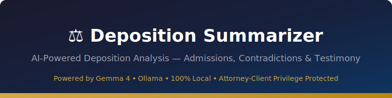
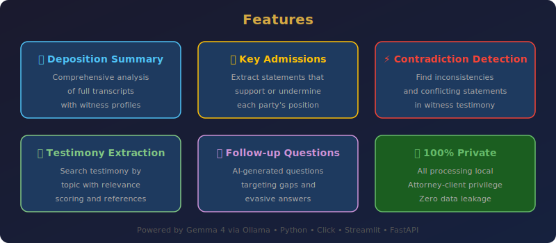
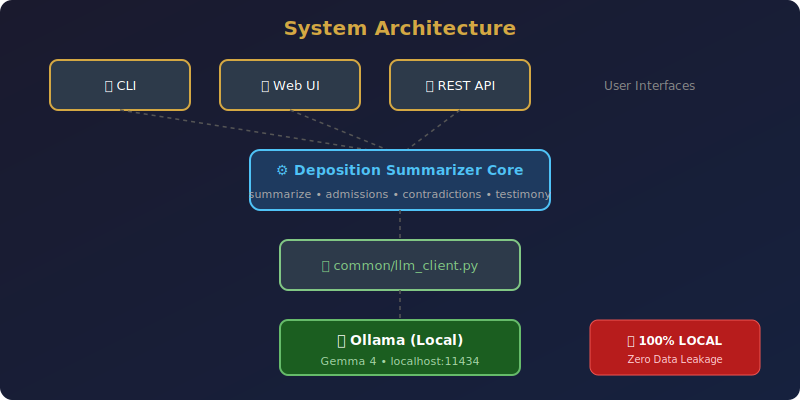

<p align="center">
  
</p>

<p align="center">
  <strong>🔒 100% Local • Zero Data Leakage • Attorney-Client Privilege Protected</strong>
</p>

<p align="center">
  
  
  
  
  
  
</p>

---

> **⚠️ Privacy Notice:** This tool runs entirely on your local machine using Ollama. No deposition transcripts, case data, or analysis results are ever transmitted to external servers. Attorney-client privilege is maintained through 100% local processing.

---

## 📑 Table of Contents

- [Features](#-features)
- [Architecture](#-architecture)
- [Quick Start](#-quick-start)
- [Docker Deployment](#-docker-deployment)
- [CLI Usage](#-cli-usage)
- [Web UI](#-web-ui)
- [API Documentation](#-api-documentation)
- [Configuration](#-configuration)
- [Testing](#-testing)
- [Project Structure](#-project-structure)
- [Privacy & Security](#-privacy--security)
- [Legal Disclaimer](#-legal-disclaimer)
- [Contributing](#-contributing)
- [License](#-license)

---

## ✨ Features

<p align="center">
  
</p>

| Feature | Description |
|---------|-------------|
| 📋 **Deposition Summary** | Comprehensive analysis of full transcripts with witness profiles, topics, and timelines |
| 🎯 **Key Admissions** | Extract statements where the witness acknowledges facts unfavorable to their position |
| ⚡ **Contradiction Detection** | Find inconsistencies and conflicting statements within the deposition |
| 📄 **Testimony Extraction** | Search and extract testimony on specific topics with relevance scoring |
| ❓ **Follow-up Questions** | AI-generated questions targeting gaps, evasive answers, and impeachment opportunities |
| 📅 **Timeline Construction** | Build chronological timeline of events referenced in testimony |
| 👤 **Witness Profiling** | Assess credibility indicators and demeanor notes |
| 🔒 **100% Private** | All processing local — zero data leakage, attorney-client privilege protected |

---

## 🏗️ Architecture

<p align="center">
  
</p>

The system follows a layered architecture:

1. **Interface Layer** — CLI (Click + Rich), Web UI (Streamlit), REST API (FastAPI)
2. **Core Engine** — `deposition_summarizer/core.py` with all analysis functions
3. **LLM Client** — Shared `common/llm_client.py` for Ollama communication
4. **LLM Backend** — Gemma 4 running locally via Ollama on `localhost:11434`

---

## 🚀 Quick Start

### Prerequisites

- **Python 3.10+**
- **Ollama** installed and running
- **Gemma 4** model pulled

### 1. Install Ollama & Pull Gemma 4

```bash
# Install Ollama (https://ollama.com)
# Then pull the model:
ollama pull gemma4:latest
ollama serve
```

### 2. Clone & Install

```bash
cd 94-deposition-summarizer
pip install -r requirements.txt
pip install -e .
```

### 3. Run

```bash
# CLI
depo-summarizer summarize --file transcript.txt

# Web UI
streamlit run src/deposition_summarizer/web_ui.py

# API
uvicorn src.deposition_summarizer.api:app --host 0.0.0.0 --port 8000
```

---

## 🐳 Docker Deployment

### Build & Run with Docker Compose

```bash
docker-compose up -d
```

This starts three services:

| Service | Port | Description |
|---------|------|-------------|
| `app` | 8501 | Streamlit Web UI |
| `api` | 8000 | FastAPI REST API |
| `ollama` | 11434 | Ollama LLM Server |

### Build Docker Image Only

```bash
docker build -t deposition-summarizer .
docker run -p 8501:8501 deposition-summarizer
```

---

## 💻 CLI Usage

The CLI provides rich, color-coded output for all analysis commands.

### Full Deposition Summary

```bash
depo-summarizer summarize --file deposition.txt
depo-summarizer summarize --file deposition.txt --model gemma4:latest
```

### Find Key Admissions

```bash
depo-summarizer admissions --file deposition.txt
```

### Detect Contradictions

```bash
depo-summarizer contradictions --file deposition.txt
```

### Extract Testimony on a Topic

```bash
depo-summarizer testimony --file deposition.txt --topic "safety valve"
depo-summarizer testimony --file deposition.txt --topic "maintenance documentation"
```

### Generate Follow-up Questions

```bash
depo-summarizer follow-up --file deposition.txt
```

### Build Timeline

```bash
depo-summarizer timeline --file deposition.txt
```

### View Legal Disclaimer

```bash
depo-summarizer disclaimer
```

### View Sample Transcript

```bash
depo-summarizer sample
```

### Global Options

```bash
depo-summarizer --verbose summarize --file deposition.txt  # Debug logging
depo-summarizer --config custom-config.yaml summarize --file deposition.txt
```

---

## 🌐 Web UI

Launch the Streamlit web interface:

```bash
streamlit run src/deposition_summarizer/web_ui.py
```

### Features

- **Dark theme** with legal gold accents
- **File upload** or paste transcript text
- **Tabbed interface:**
  - 📋 Full Summary
  - 🎯 Key Admissions
  - ⚡ Contradictions
  - 📄 Testimony (by topic)
  - ❓ Follow-up Questions
- **Color-coded results** — red for contradictions, yellow for admissions, green for favorable testimony
- **Sidebar settings** — model selection, witness name
- **Sample transcript** — one-click demo data loading

---

## 🔌 API Documentation

### Start the API Server

```bash
uvicorn src.deposition_summarizer.api:app --host 0.0.0.0 --port 8000
```

Interactive docs: [http://localhost:8000/docs](http://localhost:8000/docs)

### Endpoints

#### Health Check

```bash
GET /health
```

```json
{"status": "healthy", "ollama": "connected", "model": "gemma4:latest", "service": "deposition-summarizer"}
```

#### Full Summary

```bash
POST /summarize
Content-Type: application/json

{
  "transcript": "Q: State your name...\nA: John Smith...",
  "model": "gemma4:latest"
}
```

#### Find Admissions

```bash
POST /admissions
Content-Type: application/json

{"transcript": "...", "model": "gemma4:latest"}
```

#### Find Contradictions

```bash
POST /contradictions
Content-Type: application/json

{"transcript": "...", "model": "gemma4:latest"}
```

#### Extract Testimony

```bash
POST /testimony
Content-Type: application/json

{"transcript": "...", "topic": "safety valve", "model": "gemma4:latest"}
```

#### Follow-up Questions

```bash
POST /follow-up
Content-Type: application/json

{"transcript": "...", "model": "gemma4:latest"}
```

#### Timeline

```bash
POST /timeline
Content-Type: application/json

{"transcript": "...", "model": "gemma4:latest"}
```

---

## ⚙️ Configuration

### config.yaml

```yaml
app:
  name: "Deposition Summarizer"
  version: "1.0.0"

llm:
  model: "gemma4:latest"
  temperature: 0.3
  max_tokens: 4096
  ollama_host: "http://localhost:11434"

analysis:
  highlight_threshold: "medium"
  max_transcript_length: 50000

logging:
  level: "INFO"
  format: "%(asctime)s - %(name)s - %(levelname)s - %(message)s"
```

### Environment Variables

| Variable | Description | Default |
|----------|-------------|---------|
| `DEPOSITION_SUMMARIZER_MODEL` | LLM model name | `gemma4:latest` |
| `DEPOSITION_SUMMARIZER_TEMPERATURE` | Generation temperature | `0.3` |
| `OLLAMA_HOST` | Ollama server URL | `http://localhost:11434` |

---

## 🧪 Testing

### Run All Tests

```bash
pytest tests/ -v
```

### Run with Coverage

```bash
pytest tests/ -v --cov=src/deposition_summarizer --cov-report=term-missing
```

### Using Make

```bash
make test
make test-cov
```

### Test Categories

| Test Class | Tests | Description |
|------------|-------|-------------|
| `TestParseJsonResponse` | 7 | JSON parsing from various LLM response formats |
| `TestSummarizeDeposition` | 3 | Full deposition summary with mocked LLM |
| `TestFindAdmissions` | 3 | Admission extraction |
| `TestFindContradictions` | 2 | Contradiction detection |
| `TestExtractTestimony` | 2 | Topic-based testimony extraction |
| `TestGenerateFollowUpQuestions` | 2 | Follow-up question generation |
| `TestBuildTimeline` | 2 | Timeline construction |
| `TestDataStructures` | 6 | Dataclass defaults and creation |
| `TestSampleAndHelpers` | 5 | Sample data and display helpers |
| `TestConfig` | 5 | Configuration loading and overrides |

---

## 📁 Project Structure

```
94-deposition-summarizer/
├── src/deposition_summarizer/
│   ├── __init__.py          # Package init with version
│   ├── core.py              # Core analysis engine (all 6 functions + dataclasses)
│   ├── cli.py               # Click CLI with Rich output
│   ├── web_ui.py            # Streamlit web interface
│   ├── api.py               # FastAPI REST API
│   └── config.py            # Configuration management
├── tests/
│   └── test_core.py         # 37+ unit tests with mocked LLM
├── examples/
│   ├── demo.py              # Programmatic usage demo
│   └── README.md            # Examples documentation
├── docs/images/
│   ├── banner.svg           # Project banner
│   ├── architecture.svg     # System architecture diagram
│   └── features.svg         # Feature overview diagram
├── .github/workflows/
│   └── ci.yml               # GitHub Actions CI pipeline
├── common/
│   ├── __init__.py           # Common package init
│   └── llm_client.py         # Shared Ollama LLM client
├── config.yaml              # Default configuration
├── setup.py                 # Package setup
├── requirements.txt         # Python dependencies
├── Makefile                 # Build/run shortcuts
├── Dockerfile               # Multi-stage Docker build
├── docker-compose.yml       # Full stack deployment
├── .dockerignore            # Docker ignore rules
├── .env.example             # Environment variable template
├── README.md                # This file
├── CONTRIBUTING.md          # Contribution guidelines
└── CHANGELOG.md             # Version history
```

---

## 🔒 Privacy & Security

This tool was designed with attorney-client privilege in mind:

| Aspect | Implementation |
|--------|---------------|
| **Data Location** | All transcript data stays on your local machine |
| **LLM Processing** | Gemma 4 runs locally via Ollama — no cloud API calls |
| **Network** | Only `localhost:11434` communication (Ollama API) |
| **Logging** | Transcript content is never logged; only metadata (char counts) |
| **Storage** | No persistent storage of analysis results unless you export |
| **Docker** | Ollama runs as local sidecar container |

### Best Practices

1. ✅ Run on an air-gapped or isolated machine for maximum security
2. ✅ Use encrypted disk storage for transcript files
3. ✅ Clear analysis output after use
4. ✅ Review AI-generated summaries before sharing
5. ❌ Never upload transcripts to cloud services
6. ❌ Never commit real deposition data to version control

---

## ⚖️ Legal Disclaimer

> **IMPORTANT:** This tool is designed to **assist** legal professionals in reviewing deposition transcripts. It is **NOT** a substitute for professional legal judgment.
>
> - All analysis is generated by AI and must be verified by a licensed attorney before use in any legal proceeding.
> - This tool does **NOT** provide legal advice.
> - AI-generated summaries may contain inaccuracies or miss critical nuances in testimony.
> - Always cross-reference AI output against the original transcript.
> - 100% LOCAL processing — no data leaves your machine.
> - Attorney-client privilege is maintained through local-only processing.

---

## 🤝 Contributing

See [CONTRIBUTING.md](CONTRIBUTING.md) for guidelines.

```bash
# Quick start for contributors
git clone <repo-url>
cd 94-deposition-summarizer
pip install -e .
pip install pytest pytest-cov
pytest tests/ -v
```

---

## 📄 License

This project is part of the [90 Local LLM Projects](https://github.com/kennedyraju55/90-local-llm-projects) collection.

Licensed under the MIT License.

---

## 🙏 Acknowledgments

- [Ollama](https://ollama.ai/) — Local LLM runtime making privacy-first AI possible
- [Google Gemma 4](https://ai.google.dev/gemma) — Powerful open-weight language model
- [Streamlit](https://streamlit.io/) — Beautiful web applications in pure Python
- [FastAPI](https://fastapi.tiangolo.com/) — Modern, fast web framework for APIs
- [Click](https://click.palletsprojects.com/) — Composable command-line interface toolkit
- [Rich](https://rich.readthedocs.io/) — Beautiful terminal formatting

## 📖 Related Projects

This project is part of the **Legal Privacy Suite** within the 90 Local LLM Projects collection:

| # | Project | Description |
|---|---------|-------------|
| 91 | [Contract Clause Analyzer](../91-contract-clause-analyzer/) | Analyze contract clauses for risks and obligations |
| 92 | [Legal Case Researcher](../92-legal-case-researcher/) | Research case law and legal precedents |
| 93 | [Court Filing Generator](../93-court-filing-generator/) | Generate court filings and motions |
| **94** | **Deposition Summarizer** | **Summarize deposition transcripts** |
| 95 | [Legal Brief Writer](../95-legal-brief-writer/) | Write legal briefs and memoranda |

## 💡 Tips for Best Results

1. **Clean transcripts** — Remove page headers/footers for better analysis
2. **Specify topics** — When extracting testimony, be specific about the topic
3. **Review admissions** — Always verify AI-identified admissions against the original text
4. **Use follow-up questions** — Generated follow-up questions can inform preparation for subsequent depositions
5. **Timeline verification** — Cross-reference the AI-generated timeline with the transcript
6. **Contradiction checking** — Contradictions identified by AI should be verified by counsel

---

<p align="center">
  <strong>Built with ❤️ for legal professionals who value privacy</strong><br>
  <sub>Powered by Gemma 4 • Ollama • Python • Streamlit • FastAPI</sub>
</p>
